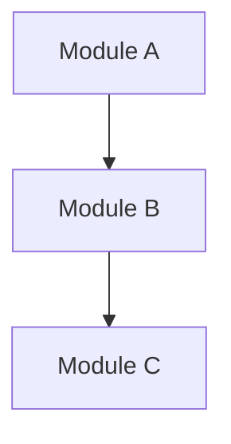

# ZeroSpec — SA (System Analysis)

需要**全系統快照**時，生成 System Analysis 文件。

**觸發條件**：
- 專案進入新里程碑階段
- 架構或核心依賴重大變更
- 新成員重複詢問相同架構問題
- 需要系統級 onboarding 文件
- Brownfield 專案初始採用 ZeroSpec 時（在 `/zerospec:build` 之後執行）

## 前置狀態確認

執行前依序檢查以下檔案：

| 檔案 | 必要條件 |
|---|---|
| `AGENTS.md` | 必須存在 |
| `CLAUDE.md` | 必須存在，且包含 `@AGENTS.md` |
| `GEMINI.md` | 必須存在，且包含 `@./AGENTS.md` 或 `@AGENTS.md` |
| `docs/README.md` | 必須存在 |

若任何一項缺少或不符合 → 列出所有缺少的項目，告知：「請先執行 `/zerospec:build` 補齊後再繼續。」並停止執行。
若全部符合 → 直接執行。

---

Generate a System Analysis document for this project as a milestone-level system snapshot.

> **Language**: Detect the repository's primary language from README, docs, and code comments. Respond in that language. Default to English if ambiguous.
> To override, prepend `Respond in {locale}` (e.g. `Respond in zh-TW`) before running this skill.

## Prerequisites

- `AGENTS.md` exists (if not, run `/zerospec:scan` + `/zerospec:build` first)
- `docs/README.md` exists (if not, run `/zerospec:build` first)

## Steps

1. **Read AGENTS.md**: Understand project summary, tech stack, architecture pattern
2. **Read docs/README.md**: Confirm naming regex and SA numbering sequence
3. **Scan top-level project structure and core modules (DO NOT recursively traverse all small files)**:
   - List all major modules/packages and their responsibilities
   - Identify core dependencies and external integrations
   - Generate a module relationship diagram (Mermaid format)
4. **Read existing SPECs and ADRs**: Incorporate documented interface contracts and decision context
5. **Produce SA document** in the following format:

```markdown
# SA-xxx: {Project Name} System Architecture Analysis

| Field         | Value          |
| ------------- | -------------- |
| Version       | v0.1           |
| Snapshot Date | {today's date} |
| Status        | Active         |

## System Overview
(One paragraph describing the system's purpose and core capabilities)

## Tech Stack
(Extract from AGENTS.md and config files, maintain Major.Minor precision)

## Architecture Pattern
(Describe layering strategy, module separation principles)

## Module Relationship Diagram



## Core Modules
| Module | Responsibility | Key Classes/Files |
| ------ | -------------- | ----------------- |
| ...    | ...            | ...               |

## External Integrations
| External System | Integration Method | Notes |
| --------------- | ------------------ | ----- |
| ...             | ...                | ...   |

## Known Risks & Tech Debt
(Infer from code quality and architecture state, mark [needs review])

## Related Documents
- AGENTS.md
- Existing SPEC / ADR list
```

## Rules

- Naming format: `SA-{3-digit}_{lowercase-hyphenated-desc}.md`
- SA is a snapshot: record "the current state" — DO NOT predict the future
- DO NOT list exact file counts; describe structural patterns
- Write versions as Major.Minor only — omit Patch
- If unable to verify from code, config files, or existing docs, mark `[unverified]` — DO NOT guess

## Post-Output Verification

1. Verify that modules and class names referenced in the document actually exist in code
2. Confirm the Mermaid diagram's module relationships match code dependencies
3. Confirm `docs/README.md` document index includes the newly created SA
