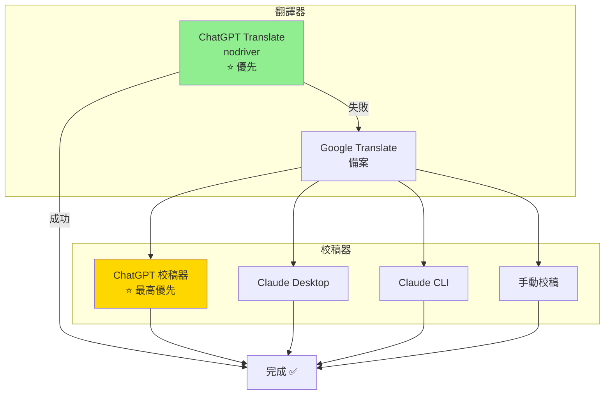
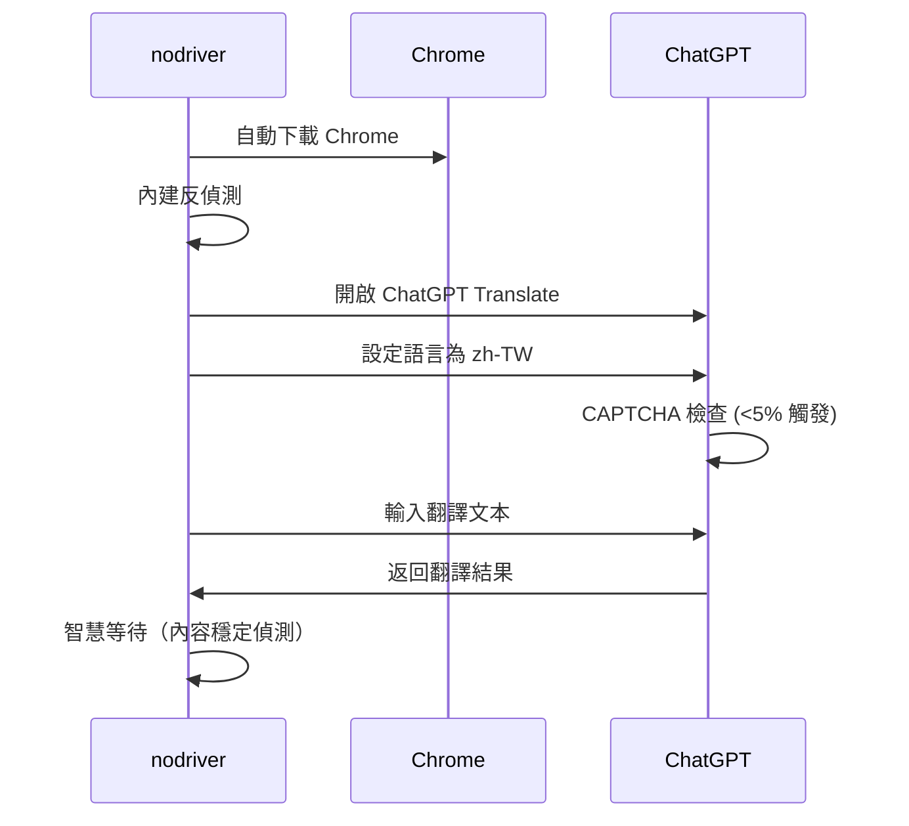
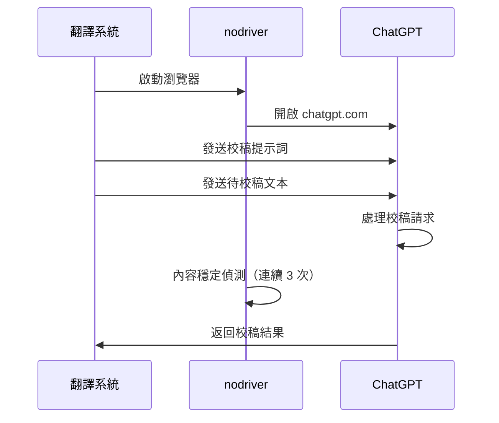
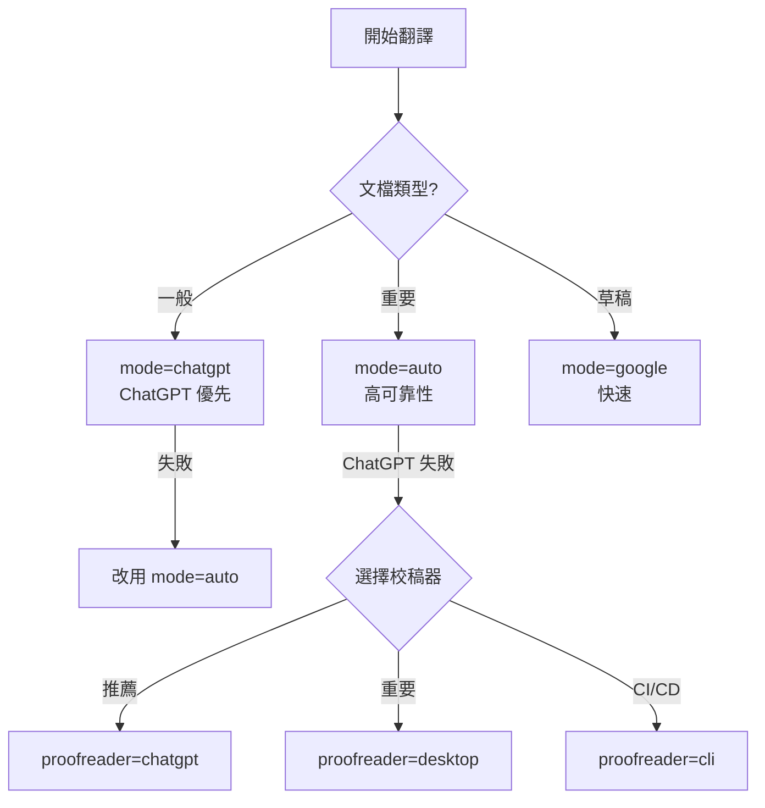

# 翻譯器與校稿後端詳細說明

> **Version**: 3.2.2 | 反映 nodriver + 智慧降級架構 + Bug 修復

## 目錄

- [架構概覽](#架構概覽)
- [主要翻譯器](#主要翻譯器)
  - [ChatGPT Translate (nodriver)](#chatgpt-translate-nodriver)
  - [Google Translate](#google-translate)
- [校稿後端](#校稿後端)
  - [ChatGPT 校稿器 (chatgpt)](#chatgpt-校稿器-chatgpt)
  - [自動偵測 (auto)](#自動偵測-auto)
  - [Claude Desktop (desktop)](#claude-desktop-desktop)
  - [Claude CLI (cli)](#claude-cli-cli)
  - [手動校稿 (manual)](#手動校稿-manual)
- [效能比較](#效能比較)

---

## 架構概覽

v3.2.0 採用**智慧降級翻譯策略 + nodriver 反偵測自動化**：



**v3.2.0 重要變更**：
- 從 Playwright 升級到 **nodriver**（CAPTCHA 觸發率 <5%）
- 新增 **ChatGPT 校稿器**（使用 chatgpt.com 對話頁面）
- 新增 **`google+proofread` 模式**（直接 Google + 校稿）
- 新增 **`--doc-type` 參數**（指定文件類型讓校稿更精準）
- 校稿器優先順序：`chatgpt` > `desktop` > `cli` > `manual`

---

## 主要翻譯器

### ChatGPT Translate (nodriver)

使用 **nodriver 反偵測自動化**操作 ChatGPT Translate 專用頁面。

#### 系統需求

- Python 3.7+
- nodriver 套件（自動下載 Chrome）
- 穩定網路連線

#### 安裝

```bash
# 安裝 Python 套件（nodriver 會自動下載 Chrome）
pip install nodriver
```

#### 工作原理



#### nodriver 反偵測技術（內建）

1. **自動隱藏 `navigator.webdriver` 標記**
2. **內建瀏覽器指紋偽裝**
3. **原生 Chrome 行為**（非控制模式）
4. **人類化打字速度**
5. **隨機延遲**
6. **持久化瀏覽器會話**（保存登入狀態）

#### 優勢

| 特性 | Selenium | Playwright | nodriver ⭐ |
|------|----------|-----------|------------|
| CAPTCHA 觸發率 | 50-70% | ~10% | **<5%** |
| 安裝複雜度 | 複雜 | 中等 | **極簡單** |
| 瀏覽器管理 | 手動 | 需安裝 | **自動下載** |
| 反偵測能力 | 需大量配置 | 需 stealth | **內建** |
| Async 支援 | ✗ | ✓ | **✓** |
| 維護需求 | 高 | 中等 | **極低** |

#### 智慧等待機制

nodriver 使用**內容穩定偵測**：

```python
# 監控輸出內容長度
while time.time() - start_time < max_wait_time:
    current_length = len(output_textarea.value)

    if current_length == last_length:
        stable_count += 1
        if stable_count >= 3:  # 連續 3 次穩定
            break  # 翻譯完成
    else:
        stable_count = 0  # 重置

    last_length = current_length
    await asyncio.sleep(3)
```

#### 瀏覽器資料持久化

- **位置**：`~/.chatgpt-translator/chrome-profile/`
- **保存內容**：登入狀態、Cookie、CAPTCHA 驗證狀態
- **好處**：首次驗證後，後續使用不需要再驗證

#### 使用方式

```bash
# 作為主要翻譯器（預設推薦）
python scripts/translate.py --mode chatgpt docs/en/FILE.md

# 智慧降級模式
python scripts/translate.py --mode auto docs/en/FILE.md

# 顯示瀏覽器視窗（調試/手動 CAPTCHA）
python scripts/translate.py --mode chatgpt --no-headless docs/en/FILE.md
```

---

### Google Translate

使用 Google Translate API 進行快速翻譯，作為**降級備案或直接使用**。

#### 系統需求

- Python 3.7+
- deep-translator 套件
- 網路連線

#### 安裝

```bash
pip install deep-translator
```

#### 工作原理

1. 呼叫 Google Translate API
2. 應用術語表替換
3. 返回粗翻結果
4. （若啟用）交給校稿器處理

#### 優勢

- 速度最快
- 穩定可靠
- 無 CAPTCHA 問題
- 完全免費

#### 限制

- 翻譯品質較低
- 需要校稿提升品質
- 可能使用簡體用語

#### 使用方式

```bash
# 僅使用 Google（無校稿）
python scripts/translate.py --mode google docs/en/FILE.md

# Google + ChatGPT 校稿（推薦）⭐
python scripts/translate.py --mode google+proofread --proofreader chatgpt docs/en/FILE.md

# Google + 校稿（自動降級模式）
python scripts/translate.py --mode auto docs/en/FILE.md
# → ChatGPT 失敗時自動使用 Google + 校稿
```

---

## 校稿後端

### ChatGPT 校稿器 (chatgpt)

**v3.1.0 新增**，使用 **chatgpt.com 對話頁面**進行校稿。

#### 優先順序

**最高優先（priority=5）**，`auto` 模式會優先偵測此校稿器。

#### 系統需求

- Python 3.7+
- nodriver 套件
- 穩定網路連線

#### 工作原理



#### 內容穩定偵測機制

```python
# 等待校稿完成
stable_count = 0
while time.time() - start_time < WAIT_TIMEOUT:
    current_length = len(last_response.text)

    if current_length == last_content_length:
        stable_count += 1
        if stable_count >= 3:  # 連續 3 次（約 9 秒）
            return True  # 校稿完成
    else:
        stable_count = 0

    last_content_length = current_length
    await asyncio.sleep(3)
```

#### 校稿提示詞結構

v3.2.0 新增 `--doc-type` 參數支援：

```
## 文件背景資訊
- 文件類型：API 技術文檔
- 翻譯來源：Google Translate 機器翻譯
- 校稿重點：機器翻譯常見問題

---

## ⚠️ 最重要規則：程式碼區塊絕對不可修改
1. 程式碼區塊必須 100% 保持原樣
2. 行內程式碼不可修改
3. 程式碼中的英文字串不可翻譯

## 臺灣慣用詞彙
- 帳號（非賬號）
- 資料（非數據）
- 軟體（非軟件）
...
```

#### 優勢

- 品質最佳 ⭐
- 完全自動化
- 完全免費
- 與翻譯器共用 Chrome Profile

#### 限制

- 依賴 chatgpt.com 網頁結構
- 需要網路連線
- 可能遇到 CAPTCHA（<5%）

#### 使用方式

```bash
# 自動偵測（優先使用 ChatGPT 校稿器）
python scripts/translate.py --mode google+proofread --proofreader auto docs/en/FILE.md

# 明確指定 ChatGPT 校稿器
python scripts/translate.py --mode google+proofread --proofreader chatgpt docs/en/FILE.md

# 指定文件類型（校稿更精準）⭐
python scripts/translate.py --mode google+proofread --proofreader chatgpt --doc-type api docs/en/API.md
```

---

### 自動偵測 (auto)

**預設設定**，自動偵測系統可用的校稿器。

#### 偵測優先順序

```
chatgpt > desktop > cli > manual
```

> **v3.1.0 變更**：新增 chatgpt 為最高優先

#### 偵測邏輯

1. 檢查 nodriver 是否可用 + 網路連線 → `chatgpt`
2. 檢查 Claude Desktop 是否安裝 → `desktop`
3. 檢查 `claude` CLI 命令是否可用 → `cli`
4. 以上皆無 → `manual`

#### 使用方式

```bash
python scripts/translate.py --mode google+proofread docs/en/FILE.md
# 或明確指定
python scripts/translate.py --mode google+proofread --proofreader auto docs/en/FILE.md
```

---

### Claude Desktop (desktop)

使用 Claude Desktop 應用程式進行校稿。

#### 系統需求

- Claude Desktop 應用程式
- macOS 或 Windows

#### 工作原理

1. 將待校稿文本寫入交換檔案
2. 通知用戶在 Claude Desktop 中處理
3. 等待用戶完成校稿
4. 讀取校稿結果

#### 優勢

- 翻譯品質佳
- 可視覺化審查過程
- 支援即時修正

#### 限制

- 需要人工操作
- 速度較慢
- 需安裝 Claude Desktop

#### 使用方式

```bash
python scripts/translate.py --mode google+proofread --proofreader desktop docs/en/FILE.md
```

---

### Claude CLI (cli)

使用 Claude CLI 命令列工具進行校稿。

#### 系統需求

- Claude CLI (`claude` 命令)
- 有效的 API 配置

#### 安裝 Claude CLI

```bash
npm install -g @anthropic-ai/claude-code
```

#### 工作原理

1. 構建校稿 prompt
2. 呼叫 `claude` 命令
3. 解析回應結果
4. 提取校稿文本

#### 優勢

- 完全腳本化
- 適合 CI/CD 整合
- 穩定可靠

#### 限制

- 需安裝 Claude CLI
- 需有效的 API 配置

#### 使用方式

```bash
python scripts/translate.py --mode google+proofread --proofreader cli docs/en/FILE.md
```

---

### 手動校稿 (manual)

開啟文字編輯器讓用戶手動校稿。

#### 系統需求

- 任一文字編輯器：VS Code、Sublime Text、nano、vi

#### 編輯器偵測順序

```
code > subl > nano > vi
```

#### 工作原理

1. 將待校稿文本寫入暫存檔
2. 開啟編輯器
3. 等待用戶編輯完成
4. 讀取編輯後文本

#### 優勢

- 無需任何 AI 工具
- 完全控制翻譯結果
- 適合細微調整

#### 限制

- 需要人工作業
- 最耗時

#### 使用方式

```bash
python scripts/translate.py --mode google+proofread --proofreader manual docs/en/FILE.md
```

---

## 效能比較

### 翻譯器比較

| 翻譯器 | 速度 | 品質 | CAPTCHA | 成本 | 適用場景 |
|--------|------|------|---------|------|----------|
| **ChatGPT (nodriver)** ⭐ | ⚡⚡ | ⭐⭐⭐⭐⭐ | <5% | $0 | 所有文檔（優先） |
| Google | ⚡⚡⚡ | ⭐⭐ | 0% | $0 | 降級備案 |

### 校稿器比較

| 校稿器 | 速度 | 品質 | 自動化 | 成本 | 優先順序 | 適用場景 |
|--------|------|------|--------|------|----------|----------|
| `chatgpt` ⭐ | ⚡⚡ | ⭐⭐⭐⭐⭐ | ✅ 全自動 | $0 | 1（最高） | 所有文檔（推薦） |
| `desktop` | ⚡ | ⭐⭐⭐⭐⭐ | ❌ 半自動 | $0 | 2 | 重要文檔 |
| `cli` | ⚡⚡ | ⭐⭐⭐⭐ | ✅ 全自動 | $0 | 3 | CI/CD |
| `manual` | ⚡ | ⭐⭐⭐ | ❌ 手動 | $0 | 4 | 少量修改 |

### 選擇建議



---

## 技術對比

### Selenium vs Playwright vs nodriver

| 特性 | Selenium | Playwright | nodriver ⭐ |
|------|----------|-----------|------------|
| CAPTCHA 觸發率 | 50-70% | ~10% | **<5%** |
| 安裝複雜度 | 需手動管理 ChromeDriver | 需 `playwright install` | **自動下載** |
| 瀏覽器管理 | 手動管理版本 | 需安裝瀏覽器 | **自動下載** |
| 效能 | 較慢 | 快 | **快** |
| 反偵測能力 | 需大量配置 | 需 stealth 插件 | **內建** |
| Async 支援 | ✗ | ✓ | **✓** |
| 狀態持久化 | 複雜 | 內建 | **內建** |
| 維護需求 | 高 | 中等 | **極低** |
| 作者 | SeleniumHQ | Microsoft | **undetected-chromedriver 作者** |

**結論**：v3.0.0 遷移到 nodriver 後，CAPTCHA 觸發率再次降低（10% → <5%），並且安裝和維護更簡單。

---

## --doc-type 參數（v3.2.0 新增）

指定文件類型可讓校稿器更精準地進行校對。

### 支援的文件類型

| 選項 | 說明 |
|------|------|
| `api` | API 技術文檔 |
| `srs` | 軟體需求規格書 |
| `design` | 軟體設計文檔 |
| `user-guide` | 使用者手冊 |
| `tutorial` | 教學文件 |
| `readme` | README 專案說明 |
| `changelog` | 變更日誌 |
| `general` | 一般技術文檔（預設）|

### 範例

```bash
# API 文檔
python scripts/translate.py --mode google+proofread --doc-type api docs/en/API.md

# 教學文件
python scripts/translate.py --mode google+proofread --doc-type tutorial docs/en/GUIDE.md
```

---

**版本歷史**：
- v3.2.0 (2025-01-20): 新增 --doc-type、強化校稿提示詞
- v3.1.0 (2025-01-20): 新增 ChatGPT 校稿器、google+proofread 模式
- v3.0.0 (2025-01-20): 遷移到 nodriver
- v2.0.0 (2025-01-18): 遷移到 Playwright + Stealth
