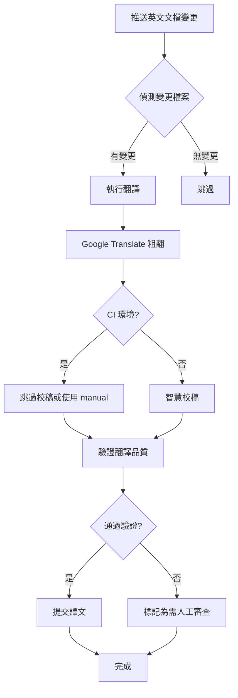

# CI/CD 整合指南

## 目錄

- [GitLab CI/CD](#gitlab-cicd)
- [GitHub Actions](#github-actions)
- [自動化流程](#自動化流程)
- [最佳實踐](#最佳實踐)

---

## GitLab CI/CD

### 基本配置

在專案根目錄建立 `.gitlab-ci.yml`：

```yaml
stages:
  - translate
  - validate
  - deploy

variables:
  TRANSLATION_MODE: "auto"
  PROOFREADER: "manual"  # CI 環境建議使用 manual 或 cli

translate_docs:
  stage: translate
  image: python:3.11
  before_script:
    - pip install googletrans==4.0.0-rc1
  script:
    - |
      # 找出變更的英文文檔
      CHANGED_FILES=$(git diff --name-only $CI_COMMIT_BEFORE_SHA $CI_COMMIT_SHA -- 'docs/en/*.md')

      if [ -n "$CHANGED_FILES" ]; then
        for file in $CHANGED_FILES; do
          echo "翻譯: $file"
          ./document-translator/scripts/translate.sh --mode=$TRANSLATION_MODE --proofreader=$PROOFREADER "$file"
        done
      else
        echo "沒有需要翻譯的文檔"
      fi
  artifacts:
    paths:
      - docs/zh-TW/
    expire_in: 1 week
  only:
    changes:
      - docs/en/**/*.md
    refs:
      - main
      - develop

validate_translation:
  stage: validate
  image: python:3.11
  script:
    - |
      # 驗證翻譯品質
      python -c "
      from document-translator.scripts.translator.validator import TranslationValidator
      import glob

      validator = TranslationValidator(verbose=True)
      errors = []

      for zh_file in glob.glob('docs/zh-TW/**/*.md', recursive=True):
          en_file = zh_file.replace('zh-TW', 'en')
          if os.path.exists(en_file):
              with open(en_file) as f:
                  source = f.read()
              with open(zh_file) as f:
                  translation = f.read()
              result = validator.validate(source, translation)
              if not result['valid']:
                  errors.append((zh_file, result['errors']))

      if errors:
          for file, errs in errors:
              print(f'ERROR: {file}')
              for err in errs:
                  print(f'  - {err}')
          exit(1)
      "
  dependencies:
    - translate_docs

commit_translations:
  stage: deploy
  script:
    - |
      git config user.email "ci@example.com"
      git config user.name "CI Bot"
      git add docs/zh-TW/
      git diff --staged --quiet || git commit -m "chore: 自動更新中文翻譯 [skip ci]"
      git push origin HEAD:$CI_COMMIT_REF_NAME
  dependencies:
    - validate_translation
  only:
    refs:
      - main
```

### 觸發條件

| 條件 | 說明 |
|------|------|
| `docs/en/**/*.md` 變更 | 只有英文文檔變更時觸發 |
| `main` 或 `develop` 分支 | 只在主要分支執行 |

---

## GitHub Actions

### 基本配置

在 `.github/workflows/translate.yml` 建立：

```yaml
name: Translate Documentation

on:
  push:
    branches: [main, develop]
    paths:
      - 'docs/en/**/*.md'
  workflow_dispatch:
    inputs:
      force:
        description: '強制重新翻譯所有文檔'
        required: false
        default: 'false'

jobs:
  translate:
    runs-on: ubuntu-latest

    steps:
      - uses: actions/checkout@v4
        with:
          fetch-depth: 2

      - name: Set up Python
        uses: actions/setup-python@v5
        with:
          python-version: '3.11'

      - name: Install dependencies
        run: |
          pip install googletrans==4.0.0-rc1

      - name: Get changed files
        id: changed-files
        run: |
          if [ "${{ github.event.inputs.force }}" == "true" ]; then
            echo "files=$(find docs/en -name '*.md' | tr '\n' ' ')" >> $GITHUB_OUTPUT
          else
            echo "files=$(git diff --name-only HEAD~1 HEAD -- 'docs/en/*.md' | tr '\n' ' ')" >> $GITHUB_OUTPUT
          fi

      - name: Translate documents
        if: steps.changed-files.outputs.files != ''
        run: |
          for file in ${{ steps.changed-files.outputs.files }}; do
            echo "翻譯: $file"
            ./document-translator/scripts/translate.sh --mode=google "$file"
          done

      - name: Commit translations
        run: |
          git config user.name "github-actions[bot]"
          git config user.email "github-actions[bot]@users.noreply.github.com"
          git add docs/zh-TW/
          git diff --staged --quiet || git commit -m "docs: 自動更新中文翻譯"
          git push
```

### 手動觸發

可在 GitHub Actions 頁面手動觸發，並選擇是否強制重新翻譯所有文檔。

---

## 自動化流程

### 推薦流程



### 環境變數

| 變數 | 說明 | 預設值 |
|------|------|--------|
| `TRANSLATION_MODE` | 翻譯模式 | `auto` |
| `PROOFREADER` | 校稿後端 | `auto` |
| `FORCE_TRANSLATE` | 強制重新翻譯 | `false` |
| `SKIP_VALIDATION` | 跳過驗證 | `false` |

---

## 最佳實踐

### 1. CI 環境建議

- **使用 `--mode=google`**: 在 CI 環境中，建議僅使用 Google Translate，避免校稿後端的複雜設定
- **或使用 `--proofreader=manual`**: 讓翻譯完成但標記需要人工審查

### 2. 分支策略

```
main
  └── develop
       ├── feature/xxx (開發時翻譯)
       └── docs/xxx (文檔專用分支)
```

- 在 `develop` 分支觸發翻譯
- 合併到 `main` 時確保譯文已審查

### 3. 提交訊息規範

```
docs: 更新 API 文檔翻譯
chore: 自動更新中文翻譯 [skip ci]
fix: 修正翻譯錯誤
```

使用 `[skip ci]` 避免無限觸發。

### 4. 審查流程

1. CI 自動翻譯並提交
2. 建立 PR 讓團隊審查
3. 審查通過後合併

### 5. 回滾策略

如果翻譯出現問題：

```bash
# 回滾到上一個版本
git checkout HEAD~1 -- docs/zh-TW/

# 或指定版本
git checkout <commit-hash> -- docs/zh-TW/
```
