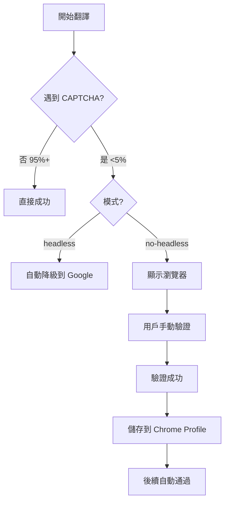
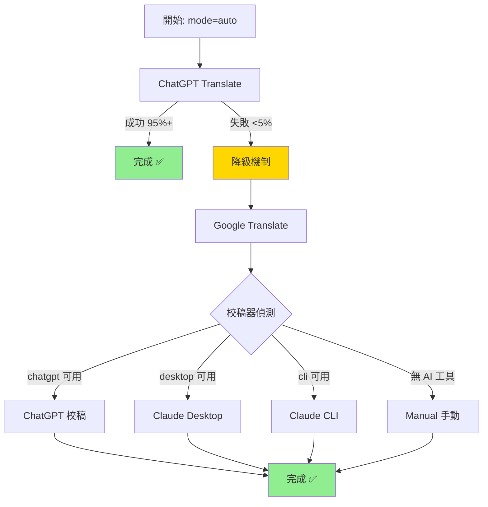

# 使用範例

> **Version**: 3.2.2 | 針對 nodriver 反偵測自動化架構 + Bug 修復

## 目錄

- [範例 1: 基本翻譯（推薦）](#範例-1-基本翻譯推薦)
- [範例 2: Google + ChatGPT 校稿](#範例-2-google--chatgpt-校稿)
- [範例 3: 指定文件類型](#範例-3-指定文件類型)
- [範例 4: 批量翻譯](#範例-4-批量翻譯)
- [範例 5: 處理 CAPTCHA（罕見）](#範例-5-處理-captcha罕見)
- [範例 6: 翻譯統計解讀](#範例-6-翻譯統計解讀)
- [範例 7: 術語表管理](#範例-7-術語表管理)
- [範例 8: 智慧降級模式](#範例-8-智慧降級模式)
- [範例 9: 翻譯純文字檔案](#範例-9-翻譯純文字檔案)

---

## 範例 1: 基本翻譯（推薦）

### 用戶請求

```
用戶: 幫我翻譯 API 文檔
```

### Claude 回應流程

1. **確認檔案**
   ```bash
   ls docs/en/API*.md
   ```

2. **執行翻譯（使用 ChatGPT Translate，品質最佳）**
   ```bash
   python scripts/translate.py --mode chatgpt docs/en/API_DOCUMENTATION.md
   ```

3. **監控過程**
   - 使用 nodriver 自動化操作
   - CAPTCHA 觸發率 <5%
   - 智慧等待機制自動偵測完成

4. **驗證輸出並報告**
   ```bash
   ls -la docs/zh-TW/API_DOCUMENTATION.md
   ```

### 完整對話範例

```
用戶: 幫我翻譯 API 文檔

Claude: 我來幫您翻譯 API 文檔。

首先確認檔案位置...找到 docs/en/API_DOCUMENTATION.md

執行翻譯（使用 ChatGPT Translate + nodriver）：
[執行命令]

[INFO] 嘗試 ChatGPT Translate...
[OK] ChatGPT Translate 成功 ✅

翻譯完成！
- 使用方法：ChatGPT Translate (nodriver)
- 輸出檔案：docs/zh-TW/API_DOCUMENTATION.md
- CAPTCHA 遭遇：0 次

[呈現翻譯後的檔案內容]
```

---

## 範例 2: Google + ChatGPT 校稿

**v3.1.0 新增** `google+proofread` 模式，適合測試校稿流程或作為備選方案。

### 用戶請求

```
用戶: 用 Google 翻譯後請 ChatGPT 校稿
```

### Claude 回應流程

```bash
python scripts/translate.py --mode google+proofread --proofreader chatgpt docs/en/API.md
```

### 執行輸出

```
[INFO] 步驟 1/2: Google Translate 粗翻...
[OK] Google Translate 完成

[INFO] 步驟 2/2: 智慧校稿 (後端: chatgpt)...
[INFO] 啟動 ChatGPT 校稿器（使用 nodriver）...
[INFO] 發送校稿提示詞...
[INFO] 等待校稿完成（內容穩定偵測）...
[OK] Google + 校稿完成

翻譯完成：docs/zh-TW/API.md
使用方法：Google + ChatGPT 校稿
```

---

## 範例 3: 指定文件類型

**v3.2.0 新增** `--doc-type` 參數讓校稿更精準。

### 用戶請求

```
用戶: 翻譯 API 技術文檔
```

### Claude 回應流程

```bash
# 方案 1: ChatGPT Translate（如果支援文件類型上下文）
python scripts/translate.py --mode chatgpt --doc-type api docs/en/API.md

# 方案 2: Google + 校稿（推薦用 --doc-type）
python scripts/translate.py --mode google+proofread --proofreader chatgpt --doc-type api docs/en/API.md
```

### 文件類型選項

| 選項 | 適用場景 | 校稿重點 |
|------|---------|---------|
| `api` | API 文檔 | 端點、參數、回應格式 |
| `srs` | 軟體需求規格書 | 需求編號、用例描述 |
| `design` | 設計文檔 | 架構圖、模式說明 |
| `user-guide` | 使用者手冊 | 操作步驟、UI 元素 |
| `tutorial` | 教學文件 | 學習路徑、範例程式碼 |
| `readme` | README 專案說明 | 安裝步驟、快速開始 |
| `changelog` | 變更日誌 | 版本號、變更項目 |
| `general` | 一般技術文檔 | 通用校對規則 |

### 完整對話範例

```
用戶: 翻譯 API 技術文檔

Claude: 我來幫您翻譯 API 技術文檔，並指定文件類型以獲得更精準的校稿。

執行命令：
python scripts/translate.py --mode google+proofread --proofreader chatgpt --doc-type api docs/en/API.md

[INFO] 文件類型：API 技術文檔
[INFO] 校稿重點：API 端點、參數、回應格式等專業術語

[INFO] 步驟 1/2: Google Translate 粗翻...
[OK] Google Translate 完成

[INFO] 步驟 2/2: 智慧校稿（加入文件類型上下文）...
[OK] 校稿完成

翻譯完成！校稿器已針對 API 文檔進行專業術語檢查。
```

---

## 範例 4: 批量翻譯

### 用戶請求

```
用戶: 翻譯 docs/en 下所有文檔
```

### Claude 回應流程

1. **列出檔案**
   ```bash
   ls docs/en/*.md
   ```

2. **確認數量**
   ```
   找到 5 個 Markdown 檔案
   ```

3. **執行批量翻譯**
   ```bash
   python scripts/translate.py --mode chatgpt docs/en/*.md
   ```

4. **報告統計結果**

### 執行輸出

```
============================================================
翻譯完成
============================================================
總計: 5 個檔案
✅ 成功: 5
❌ 失敗: 0

============================================================
翻譯統計 (nodriver 模式)
============================================================
ChatGPT 成功: 5 (100%)
ChatGPT 失敗: 0 (0%)
降級到 Google: 0
ChatGPT 成功率: 100.0%
CAPTCHA 遭遇: 0 次 (0.0%)
============================================================
```

### 對話範例

```
用戶: 翻譯 docs/en 下所有文檔

Claude: 找到 5 個檔案需要翻譯，開始執行：

[執行批量翻譯]

翻譯完成！結果：
✅ API.md - ChatGPT 成功
✅ GETTING_STARTED.md - ChatGPT 成功
✅ FAQ.md - ChatGPT 成功
✅ CHANGELOG.md - ChatGPT 成功
✅ CONTRIBUTING.md - ChatGPT 成功

統計：
- ChatGPT 成功率: 100%
- CAPTCHA 遭遇: 0 次
- 所有譯文已存放在 docs/zh-TW/
```

---

## 範例 5: 處理 CAPTCHA（罕見）

### 場景：遇到 CAPTCHA 驗證（<5% 機率）

```
用戶: ChatGPT 翻譯出現「我不是機器人」驗證

Claude: v3.0.0 使用 nodriver 反偵測技術後，CAPTCHA 觸發率已降至 <5%。

如果仍然遇到，可以使用有頭模式手動驗證：

python scripts/translate.py --mode chatgpt --no-headless docs/en/API.md

這會開啟瀏覽器視窗，讓您手動完成驗證。
驗證完成後，狀態會被儲存到 ~/.chatgpt-translator/chrome-profile/，
後續翻譯就不需要再驗證了。

[執行中...]

✅ 驗證完成，翻譯成功！
```

### CAPTCHA 處理流程



### nodriver 優勢

| 技術 | CAPTCHA 觸發率 | 驗證後狀態保存 |
|------|---------------|---------------|
| Selenium | 50-70% | ❌ 不可靠 |
| Playwright | ~10% | ✅ 可用 |
| **nodriver** | **<5%** ⭐ | ✅ **持久化** |

---

## 範例 6: 翻譯統計解讀

### 查看統計

```
用戶: 最近的翻譯使用 ChatGPT 的成功率如何？

Claude: 讓我執行一次翻譯來展示統計功能：

python scripts/translate.py --mode chatgpt --verbose docs/en/*.md
```

### 統計輸出解讀

```
============================================================
翻譯統計 (nodriver 模式)
============================================================
ChatGPT 成功: 9 (90%)  ⬆️ 比 Selenium 提高 ~40%
ChatGPT 失敗: 1 (10%)
降級到 Google: 0       # 使用 chatgpt 模式無降級
ChatGPT 成功率: 90.0%
CAPTCHA 遭遇: 0 次 (0.0%)  ⬇️ 比 Selenium 減少 ~90%
============================================================
```

### 統計指標說明

| 指標 | 說明 | 理想值 |
|------|------|--------|
| ChatGPT 成功率 | ChatGPT Translate 成功比例 | >90% |
| CAPTCHA 遭遇次數 | 觸發人類驗證的次數 | 0 |
| 降級次數 | 使用 Google + 校稿的次數 | <10% |

---

## 範例 7: 術語表管理

### 新增自定義術語

```
用戶: 專案中有一些特殊術語，想要固定翻譯

Claude: 我可以幫您更新術語表。請告訴我要新增哪些術語？

用戶:
- "workflow" 翻譯成 "工作流程"
- "pipeline" 翻譯成 "流水線"
- 保持 "Kubernetes" 不翻譯

Claude: 好的，我來更新 scripts/config/glossary.json：
```

### 編輯術語表

```json
{
  "technical_terms": {
    "API": "API",
    "endpoint": "端點",
    "workflow": "工作流程",
    "pipeline": "流水線"
  },
  "taiwan_terms": {
    "account": "帳號",
    "data": "資料",
    "software": "軟體",
    "network": "網路"
  },
  "preserve": [
    "Claude",
    "GitHub",
    "Docker",
    "Kubernetes"
  ]
}
```

### 驗證術語表

```bash
# 檢查 JSON 格式
cat scripts/config/glossary.json | python3 -m json.tool

# 執行翻譯測試
python scripts/translate.py --mode google docs/en/test.md
```

---

## 範例 8: 智慧降級模式

### 用戶請求

```
用戶: 我需要確保翻譯一定能完成
```

### Claude 回應流程

```bash
# 使用 auto 模式：ChatGPT 失敗自動降級到 Google + 校稿
python scripts/translate.py --mode auto docs/en/API.md
```

### 執行輸出（ChatGPT 成功）

```
[INFO] 嘗試 ChatGPT Translate...
[OK] ChatGPT Translate 成功
翻譯完成：docs/zh-TW/API.md
使用方法：ChatGPT
```

### 執行輸出（降級情況）

```
[INFO] 嘗試 ChatGPT Translate...
[WARN] ChatGPT Translate 失敗
[FALLBACK] 降級到 Google Translate + 校稿
[INFO] 步驟 1/2: Google Translate 粗翻...
[OK] Google Translate 完成
[INFO] 步驟 2/2: 智慧校稿 (後端: chatgpt)...
[OK] Google + 校稿完成
翻譯完成：docs/zh-TW/API.md
使用方法：Google + 校稿（降級）
```

### 降級流程圖



---

## 進階使用場景

### 場景 1: CI/CD 自動化翻譯

```bash
# 使用 auto 模式 + cli 校稿器（適合 CI/CD）
python scripts/translate.py --mode auto --proofreader cli docs/en/*.md
```

### 場景 2: 重要文檔翻譯

```bash
# 使用 ChatGPT + Desktop 校稿（品質最佳）
python scripts/translate.py --mode chatgpt docs/en/IMPORTANT.md

# 如果 ChatGPT 失敗，使用 Google + Desktop 校稿
python scripts/translate.py --mode google+proofread --proofreader desktop docs/en/IMPORTANT.md
```

### 場景 3: 快速草稿翻譯

```bash
# 僅使用 Google Translate（最快，無校稿）
python scripts/translate.py --mode google docs/en/DRAFT.md
```

### 場景 4: 測試校稿流程

```bash
# 測試 ChatGPT 校稿器
python scripts/translate.py --mode google+proofread --proofreader chatgpt --no-headless docs/en/test.md

# 指定文件類型測試
python scripts/translate.py --mode google+proofread --proofreader chatgpt --doc-type api docs/en/test.md
```

---

## 命令速查表

### 基本命令

```bash
# 推薦：ChatGPT Translate（品質最佳）
python scripts/translate.py --mode chatgpt docs/en/FILE.md

# 高可靠性：智慧降級
python scripts/translate.py --mode auto docs/en/FILE.md

# Google + ChatGPT 校稿
python scripts/translate.py --mode google+proofread --proofreader chatgpt docs/en/FILE.md

# 指定文件類型
python scripts/translate.py --mode google+proofread --doc-type api docs/en/API.md

# 有頭模式（調試/手動 CAPTCHA）
python scripts/translate.py --mode chatgpt --no-headless docs/en/FILE.md

# 批量翻譯
python scripts/translate.py --mode chatgpt docs/en/*.md

# 強制覆蓋 + 詳細日誌
python scripts/translate.py --mode chatgpt --force --verbose docs/en/FILE.md
```

### Shell 腳本入口（可選）

```bash
# 使用 translate.sh（會自動設定虛擬環境）
./scripts/translate.sh --mode chatgpt docs/en/FILE.md

# 查看幫助
./scripts/translate.sh --help
```

---

## 範例 9: 翻譯純文字檔案

### 用戶請求

```
用戶: 我有一個 README.txt 檔案需要翻譯
```

### Claude 回應流程

```bash
# 純文字檔案可以直接翻譯
python scripts/translate.py --mode chatgpt docs/en/README.txt
```

### 支援的檔案格式

✅ **可直接翻譯**：
- `.md` - Markdown（主要用途，範例 1-8）
- `.txt` - 純文字檔案
- `.rst` - reStructuredText
- `.html` - HTML 檔案

❌ **不支援**：
- `.docx` - Word 文件
- `.pdf` - PDF 文件

### 執行輸出

```
[INFO] 翻譯: docs/en/README.txt
[INFO] 嘗試 ChatGPT Translate...
[OK] ChatGPT Translate 成功
[OK] 翻譯完成: docs/zh-TW/README.txt
```

### 處理 Word/PDF 的建議

如需翻譯 Word 或 PDF 檔案：

```bash
# 方案 1: 手動轉換
# 1. 複製 Word/PDF 內容到 .md 檔案
# 2. 翻譯 Markdown
python scripts/translate.py --mode chatgpt docs/en/content.md
# 3. 再複製回原檔案

# 方案 2: 使用 pandoc 轉換
pandoc input.docx -o output.md
python scripts/translate.py --mode chatgpt output.md
pandoc output.zh-TW.md -o output.zh-TW.docx
```

### 完整對話範例

```
用戶: 我有一個 README.txt 需要翻譯

Claude: 純文字檔案可以直接使用翻譯工具。

執行命令：
python scripts/translate.py --mode chatgpt docs/en/README.txt

[執行中...]

翻譯完成！
- 輸入：docs/en/README.txt
- 輸出：docs/zh-TW/README.txt
- 使用方法：ChatGPT Translate

---

用戶: 那 Word 檔案呢？

Claude: Word (.docx) 和 PDF 檔案是二進位格式，無法直接翻譯。

建議做法：
1. 將 Word 內容複製到 .md 檔案
2. 使用翻譯工具處理 Markdown
3. 再複製回 Word

或者使用 pandoc 工具自動轉換：
pandoc yourfile.docx -o yourfile.md
python scripts/translate.py --mode chatgpt yourfile.md

詳見：SKILL.md 的「支援的檔案格式」章節
```

---

## 版本更新說明

### v3.2.2 (2026-02-06)
- 修復 macOS 瀏覽器連接問題
- 修復 asyncio 事件循環錯誤
- 更新 Chrome Profile 路徑（chrome-profile-v3）

### v3.2.1 (2026-02-06)
- 新增範例 9：翻譯純文字檔案
- 說明支援的檔案格式範圍
- 提供 Word/PDF 處理建議

### v3.2.0 (2025-01-20)
- 新增 `--doc-type` 參數範例
- 新增文件類型指定場景
- 更新程式碼保護範例

### v3.1.0 (2025-01-20)
- 新增 `google+proofread` 模式範例
- 新增 ChatGPT 校稿器範例
- 更新校稿器選擇場景

### v3.0.0 (2025-01-20)
- 從 Playwright 更新到 nodriver
- CAPTCHA 觸發率降至 <5%
- 更新所有命令範例

### v2.0.0 (2025-01-18)
- 從 Selenium 更新到 Playwright + Stealth
- CAPTCHA 觸發率降至 ~10%
