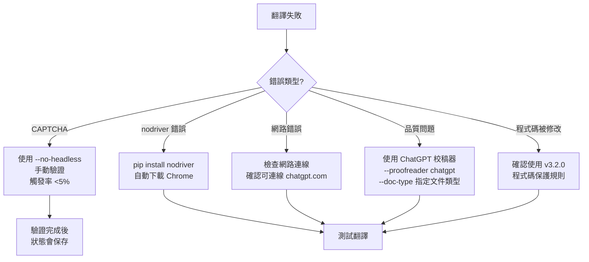

# 故障排除指南

> **Version**: 3.2.2 | 針對 nodriver 反偵測自動化架構 + Bug 修復

## 目錄

- [問題 1: CAPTCHA 驗證（罕見）](#問題-1-captcha-驗證罕見)
- [問題 2: nodriver 安裝問題](#問題-2-nodriver-安裝問題)
- [問題 3: ChatGPT 翻譯失敗](#問題-3-chatgpt-翻譯失敗)
- [問題 4: ChatGPT 校稿器失敗](#問題-4-chatgpt-校稿器失敗)
- [問題 5: 降級機制未觸發](#問題-5-降級機制未觸發)
- [問題 6: 翻譯品質不佳](#問題-6-翻譯品質不佳)
- [問題 7: 程式碼區塊被修改](#問題-7-程式碼區塊被修改)
- [問題 8: 翻譯不完整](#問題-8-翻譯不完整)
- [問題 9: 無法翻譯 Word/PDF 檔案](#問題-9-無法翻譯-wordpdf-檔案)
- [問題 10: macOS 瀏覽器連接失敗（v3.2.2 已修復）](#問題-10-macos-瀏覽器連接失敗v322-已修復)
- [環境重建步驟](#環境重建步驟)
- [除錯指令](#除錯指令)

---

## 問題 1: CAPTCHA 驗證（罕見）

### 現象

- 網頁出現「我不是機器人」驗證
- Cloudflare 或 reCAPTCHA 挑戰
- 翻譯失敗並顯示驗證相關訊息

### 原因

- 自動化工具被偵測（nodriver 已大幅降低觸發率）
- IP 地址被標記
- 請求頻率過高

### nodriver 優勢

nodriver 內建反偵測技術，CAPTCHA 觸發率極低：

| 技術 | CAPTCHA 觸發率 |
|------|---------------|
| Selenium | 50-70% |
| Playwright | ~10% |
| **nodriver** | **<5%** ⭐ |

### 解決方案

```bash
# 方案 1: 使用 nodriver 內建反偵測（預設）
python scripts/translate.py --mode chatgpt docs/en/API.md
# ✓ nodriver 會自動避開大部分偵測
# ✓ CAPTCHA 觸發率已降至 <5%

# 方案 2: 有頭模式（讓用戶手動解決 CAPTCHA）
python scripts/translate.py --mode chatgpt --no-headless docs/en/API.md
# ✓ 瀏覽器視窗會顯示，用戶可手動完成驗證
# ✓ 驗證完成後，狀態會被儲存到 Chrome Profile

# 方案 3: 降級到 Google（自動）
python scripts/translate.py --mode auto docs/en/API.md
# auto 模式會自動降級，無需手動干預
```

### 瀏覽器資料持久化

nodriver 會將驗證狀態保存到：
```
~/.chatgpt-translator/chrome-profile-v3/
```

**好處**：首次驗證後，後續使用不需要再驗證。

### 預防措施

```bash
# 批量翻譯時加入延遲
for file in docs/en/*.md; do
    python scripts/translate.py --mode chatgpt "$file"
    sleep 10  # 每個檔案間隔 10 秒
done
```

---

## 問題 2: nodriver 安裝問題

### 現象

- 錯誤訊息：`ModuleNotFoundError: No module named 'nodriver'`
- Chrome 下載失敗
- 瀏覽器無法啟動

### 原因

- nodriver 未正確安裝
- 網路連線問題（無法下載 Chrome）
- 磁碟空間不足

### 解決方案

```bash
# 確保 Python 版本 >= 3.7
python3 --version

# 安裝 nodriver（會自動下載 Chrome）
pip install nodriver

# 驗證安裝
python3 -c "import nodriver; print('nodriver OK')"
```

### nodriver 優勢

與 Playwright 相比：
- ✅ **無需** 執行 `playwright install chromium`
- ✅ **自動下載** Chrome（不依賴系統版本）
- ✅ **內建反偵測**（無需額外 stealth 設定）
- ✅ **極簡單**安裝流程

### 清除 Chrome 資料（如遇問題）

```bash
# 清除 Chrome Profile（重新開始）
rm -rf ~/.chatgpt-translator/chrome-profile-v3/

# nodriver 會在下次使用時自動重建
```

### macOS 特殊問題

```bash
# 如果遇到權限問題，可能需要授權：
# System Preferences → Security & Privacy → Privacy
# - Accessibility（輔助使用）
# - Screen Recording（螢幕錄製）
```

### Docker / CI 環境

```bash
# 安裝系統依賴
apt-get update
apt-get install -y libnss3 libatk-bridge2.0-0 libdrm2 libgbm1 libxkbcommon0

# 安裝 nodriver
pip install nodriver

# nodriver 會自動處理 Chrome 下載
```

---

## 問題 3: ChatGPT 翻譯失敗

### 可能原因

- 網頁結構改變
- 網路連線問題
- CAPTCHA（參見問題 1，<5% 機率）
- 語言選擇器設定失敗

### 診斷步驟

```bash
# 檢查網路連線
curl -I https://chatgpt.com

# 查看詳細錯誤
python scripts/translate.py --mode chatgpt --verbose docs/en/FILE.md

# 使用有頭模式觀察
python scripts/translate.py --mode chatgpt --no-headless docs/en/FILE.md
```

### 解決方案

```bash
# 方案 1: 使用 auto 模式（有降級）
python scripts/translate.py --mode auto docs/en/FILE.md

# 方案 2: 清除瀏覽器狀態
rm -rf ~/.chatgpt-translator/chrome-profile-v3/

# 方案 3: 有頭模式重新驗證
python scripts/translate.py --mode chatgpt --no-headless docs/en/FILE.md
```

### 翻譯不完整

如果翻譯結果被截斷：

```bash
# 智慧等待機制會自動偵測翻譯完成
# 最大等待時間根據文字長度動態調整（60-180 秒）

# 如果仍有問題，可分段翻譯較長的文檔
```

---

## 問題 4: ChatGPT 校稿器失敗

**v3.1.0 新增**的 ChatGPT 校稿器可能遇到的問題。

### 可能原因

- 網頁結構改變
- 回應取得失敗
- 內容穩定偵測超時

### 診斷步驟

```bash
# 使用有頭模式觀察校稿過程
python scripts/translate.py --mode google+proofread --proofreader chatgpt --no-headless docs/en/FILE.md

# 查看詳細日誌
python scripts/translate.py --mode google+proofread --proofreader chatgpt --verbose docs/en/FILE.md
```

### 解決方案

```bash
# 方案 1: 使用其他校稿器
python scripts/translate.py --mode google+proofread --proofreader desktop docs/en/FILE.md

# 方案 2: 清除瀏覽器狀態（與翻譯器共用）
rm -rf ~/.chatgpt-translator/chrome-profile-v3/

# 方案 3: 使用 auto 校稿器偵測
python scripts/translate.py --mode google+proofread --proofreader auto docs/en/FILE.md
# 如果 ChatGPT 校稿器失敗，會自動降級到其他校稿器
```

---

## 問題 5: 降級機制未觸發

### 可能原因

- 使用了 `--no-fallback` 參數
- 使用 `chatgpt` 模式而非 `auto` 模式

### 解決方案

```bash
# 確保使用 auto 模式且未禁用降級
python scripts/translate.py --mode auto docs/en/API.md
# 不要使用 --no-fallback
```

### 翻譯模式說明

| 模式 | 降級行為 |
|------|---------|
| `chatgpt` | 無降級，失敗就停止 |
| `auto` | ChatGPT 失敗 → Google + 校稿 |
| `google+proofread` | 直接使用 Google + 校稿 |
| `google` | 直接使用 Google（無校稿）|

---

## 問題 6: 翻譯品質不佳

### 診斷

1. 檢查使用的翻譯方法（查看日誌）
2. ChatGPT 成功 → 品質應該很好
3. 降級到 Google → 可能需要更好的校稿器

### 解決方案

```bash
# 檢查是否使用了 ChatGPT（查看日誌）
python scripts/translate.py --mode auto --verbose docs/en/API.md

# 如果降級到了 Google，使用 ChatGPT 校稿器（推薦）⭐
python scripts/translate.py --mode google+proofread --proofreader chatgpt docs/en/API.md

# 指定文件類型讓校稿更精準（v3.2.0 新增）⭐
python scripts/translate.py --mode google+proofread --proofreader chatgpt --doc-type api docs/en/API.md

# 或使用 Claude Desktop
python scripts/translate.py --mode google+proofread --proofreader desktop docs/en/API.md
```

### 更新術語表

編輯 `scripts/config/glossary.json`：

```json
{
  "technical_terms": {
    "新術語": "翻譯"
  },
  "taiwan_terms": {
    "account": "帳號",
    "data": "資料"
  }
}
```

---

## 問題 7: 程式碼區塊被修改

**v3.2.0 已強化程式碼區塊保護規則**

### 現象

- 程式碼區塊中的內容被翻譯
- 程式碼中的英文字串被改成中文
- Markdown 程式碼圍欄標記被移除

### 原因

- 校稿提示詞未正確載入
- 使用舊版校稿提示詞

### 解決方案

```bash
# 確保使用最新版本的 proofreading_prompt.txt
cat scripts/config/proofreading_prompt.txt | head -20
# 應該包含「⚠️ 最重要規則：程式碼區塊絕對不可修改」

# 如果提示詞檔案缺失或過舊，請更新
```

### v3.2.0 程式碼保護規則

校稿提示詞已加入最高優先級規則：

1. **程式碼區塊**：` ```語言 ` 和 ` ``` ` 之間的內容不可修改
2. **行內程式碼**：反引號 `` ` `` 包圍的內容保持原樣
3. **英文字串**：`'networkidle'`、`'POST'` 等保持原文

---

## 問題 8: 翻譯不完整

### 現象

- 翻譯結果被截斷
- 輸出字數明顯少於輸入

### 原因

- 等待時間不足（長文檔需要更多時間）

### 解決方案

```bash
# v3.0.0 已實作智慧等待機制（內容穩定偵測）
# 連續 3 次（約 9 秒）內容長度不變 → 翻譯完成
# 最大等待時間會根據文字長度動態調整（60-180 秒）

# 如果仍有問題，可分段翻譯較長的文檔
```

### 內容穩定偵測機制

```python
# 監控輸出內容長度
stable_count = 0
while time.time() - start_time < max_wait_time:
    current_length = len(output_textarea.value)

    if current_length == last_length:
        stable_count += 1
        if stable_count >= 3:  # 連續 3 次穩定
            break  # 翻譯完成
    else:
        stable_count = 0
```

---

## 問題 9: 無法翻譯 Word/PDF 檔案

### 現象

- 嘗試翻譯 `.docx` 或 `.pdf` 檔案時失敗
- 出現編碼錯誤或檔案讀取錯誤
- 翻譯結果亂碼或為空

### 原因

此工具**主要設計用於純文字檔案**（特別是 Markdown），無法直接處理二進位格式如 Word (.docx) 或 PDF (.pdf)。

### 支援的檔案格式

✅ **完全支援**：
- `.md` - Markdown（主要用途）
- `.txt` - 純文字
- `.rst` - reStructuredText
- `.html` - HTML 檔案
- 其他 UTF-8 純文字格式

❌ **不支援**：
- `.docx` - Word 文件
- `.pdf` - PDF 文件
- `.xlsx` - Excel 檔案
- 其他二進位格式

### 解決方案

#### 方案 1: 手動轉換（最簡單）

```bash
# 1. 開啟 Word/PDF 檔案
# 2. 複製內容到新的 .md 檔案
# 3. 使用本工具翻譯
python scripts/translate.py --mode chatgpt docs/en/content.md
# 4. 再將翻譯結果複製回 Word/PDF
```

#### 方案 2: 使用其他 Claude Skills（推薦）

```bash
# 如果使用 Claude Code 環境，可結合其他 skills：

# 處理 Word 檔案
# 1. 使用 docx skill 讀取 Word 內容
# 2. 提取純文字儲存為 .md
# 3. 使用 document-translator 翻譯
# 4. 使用 docx skill 寫回 Word

# 處理 PDF 檔案
# 1. 使用 pdf skill 提取文字
# 2. 儲存為 .md 格式
# 3. 使用 document-translator 翻譯
```

#### 方案 3: 使用外部工具轉換

```bash
# 使用 pandoc 轉換 Word 到 Markdown
pandoc input.docx -o output.md

# 翻譯 Markdown
python scripts/translate.py --mode chatgpt output.md

# 轉回 Word（可選）
pandoc output.zh-TW.md -o output.zh-TW.docx
```

#### 方案 4: 翻譯純文字檔案（.txt）

純文字檔案可以直接使用：

```bash
# .txt 檔案可直接翻譯
python scripts/translate.py --mode chatgpt docs/en/README.txt

# 輸出也是 .txt 格式
# docs/zh-TW/README.txt
```

### 預防措施

- 確認檔案副檔名是否為支援的格式
- 建議將重要文檔保存為 Markdown 格式以便自動化翻譯
- 對於混合格式專案，建立 `docs/en/` 資料夾專門存放 Markdown 源文件

### 相關連結

- [SKILL.md - 支援的檔案格式](../SKILL.md#支援的檔案格式)
- [Pandoc 文件轉換工具](https://pandoc.org/)

---

## 問題 10: macOS 瀏覽器連接失敗（v3.2.2 已修復）

### 現象

```
Failed to connect to browser
---------------------
One of the causes could be when you are running as root.
In that case you need to pass no_sandbox=True
```

或：

```
Exception in atexit callback <function deconstruct_browser>:
AttributeError: 'NoneType' object has no attribute 'disconnect'
```

### 原因

**問題 1：macOS 安全性限制**
- macOS 系統對瀏覽器沙盒有嚴格限制
- nodriver 預設使用 `sandbox=True`，在 macOS 上可能導致連接失敗

**問題 2：Asyncio 事件循環錯誤**
- 程式退出時事件循環已被清除
- `__del__` 方法無法正確關閉瀏覽器連接

**問題 3：Chrome Profile 資料損壞**
- 舊版本的 Chrome profile 資料可能損壞
- 導致後續連接失敗

### ✅ v3.2.2 已修復

**如果你使用 v3.2.2 或更新版本，這些問題已經修復！**

修復內容：
1. ✅ 在 macOS 上自動使用 `sandbox=False`
2. ✅ 加入 `--no-sandbox` 和 `--disable-setuid-sandbox` 瀏覽器參數
3. ✅ 安全地處理 asyncio 事件循環清理
4. ✅ 使用新的 Chrome Profile 資料夾 `chrome-profile-v3`

### 如果仍然遇到問題

#### 方案 1：確認版本

```bash
# 檢查版本
grep "version:" document-translator/SKILL.md

# 應該顯示 version: 3.2.2 或更新
```

#### 方案 2：清除舊的 Chrome Profile

```bash
# 清除舊資料（如果從舊版本升級）
rm -rf ~/.chatgpt-translator/chrome-profile-v3/

# 新版本會自動使用 chrome-profile-v3
```

#### 方案 3：使用 Google + ChatGPT 校稿（不需瀏覽器）

```bash
# 這個模式完全不會遇到瀏覽器連接問題
python scripts/translate.py --mode google+proofread --proofreader chatgpt docs/en/FILE.md
```

#### 方案 4：手動測試瀏覽器啟動

```bash
cd scripts
source venv/bin/activate

python << 'EOF'
import asyncio
import nodriver as uc

async def test():
    try:
        print("測試瀏覽器啟動...")
        browser = await uc.start(
            headless=False,
            sandbox=False,
            browser_args=["--no-sandbox", "--disable-setuid-sandbox"]
        )
        print("✅ 成功！瀏覽器已啟動")
        await asyncio.sleep(2)
        browser.stop()
        print("✅ 瀏覽器已關閉")
    except Exception as e:
        print(f"❌ 錯誤: {e}")

uc.loop().run_until_complete(test())
EOF
```

### 升級到 v3.2.2

如果你使用的是舊版本：

```bash
# 1. 下載最新版本
# document-translator-skill-v3.2.2.tar.gz

# 2. 備份配置（如有自訂）
cp scripts/config/glossary.json ~/glossary.json.bak

# 3. 解壓縮新版本
tar -xzf document-translator-skill-v3.2.2.tar.gz

# 4. 重新安裝依賴
cd document-translator/scripts
pip install -r requirements.txt

# 5. 測試
python translate.py --help
```

### 相關連結

- [CHANGELOG.md - v3.2.2 修復說明](../CHANGELOG.md)
- [RELEASE_NOTES_v3.2.2.md - 詳細發布說明](../RELEASE_NOTES_v3.2.2.md)

---

## 環境重建步驟

當遇到難以診斷的問題時，可以完全重建環境：

```bash
# 1. 備份配置
cp -r scripts/config scripts/config.backup

# 2. 清除環境
cd scripts
rm -rf venv
rm -rf __pycache__
rm -rf translator/__pycache__

# 3. 清除瀏覽器狀態
rm -rf ~/.chatgpt-translator/chrome-profile-v3/

# 4. 重建環境
python3 -m venv venv
source venv/bin/activate
pip install -r requirements.txt
# nodriver 會自動下載 Chrome，無需額外安裝

# 5. 驗證
python scripts/translate.py --mode chatgpt --verbose docs/en/test.md
```

---

## 除錯指令

### 查看翻譯日誌

```bash
# 詳細輸出
python scripts/translate.py --mode auto --verbose docs/en/FILE.md 2>&1 | tee translation.log
```

### 檢查配置檔案

```bash
# 術語表
cat scripts/config/glossary.json | python3 -m json.tool

# 校稿提示詞
cat scripts/config/proofreading_prompt.txt | head -30
```

### 驗證輸出檔案

```bash
# 檢查譯文是否生成
ls -la docs/zh-TW/

# 比較檔案大小
wc -l docs/en/FILE.md docs/zh-TW/FILE.md

# 檢查是否有簡體字
grep -E '账|数据|软件|网络|服务器|内存' docs/zh-TW/FILE.md
```

### 測試 nodriver 可用性

```bash
# 測試 nodriver
python3 -c "import nodriver; print('nodriver OK')"

# 測試 async 支援
python3 -c "import asyncio; print('asyncio OK')"

# 檢查 Python 版本
python3 --version  # 應該 >= 3.7
```

### 測試校稿器可用性

```bash
# 測試 nodriver（ChatGPT 校稿器）
python3 -c "import nodriver; print('ChatGPT Proofreader OK')"

# 測試 Claude CLI
which claude && echo "CLI OK"

# 測試 Claude Desktop
ls /Applications/Claude.app && echo "Desktop OK" || echo "Desktop not found"
```

### 測試翻譯器

```bash
# 測試 ChatGPT 翻譯器（有頭模式）
python scripts/translate.py --mode chatgpt --no-headless docs/en/test.md

# 測試 Google 翻譯器
python scripts/translate.py --mode google docs/en/test.md

# 測試 Google + ChatGPT 校稿
python scripts/translate.py --mode google+proofread --proofreader chatgpt docs/en/test.md
```

---

## 錯誤代碼參考

| 錯誤訊息 | 原因 | 解決方案 |
|----------|------|----------|
| `FileNotFoundError` | 來源檔案不存在 | 確認檔案路徑 |
| `PermissionError` | 無執行權限 | `chmod +x translate.sh` |
| `ModuleNotFoundError: nodriver` | nodriver 未安裝 | `pip install nodriver` |
| `ModuleNotFoundError: deep_translator` | deep-translator 未安裝 | `pip install deep-translator` |
| `Chrome download failed` | 網路問題或磁碟空間不足 | 檢查網路和磁碟空間 |
| `CAPTCHA detected` | 人類驗證觸發（<5%） | 使用 `--no-headless` 手動驗證 |
| `asyncio` 相關錯誤 | Python 版本問題 | 確保 Python >= 3.7 |
| `Timeout` | 網路或服務逾時 | 檢查網路，重試 |
| `Connection refused` | 網路問題 | 檢查網路連線 |
| `object str can't be used in 'await'` | nodriver 屬性錯誤 | 已在 v3.0.0 修復 |

---

## 常見問題決策樹



---

## 版本更新說明

### v3.2.0 (2025-01-20)
- 新增 `--doc-type` 參數
- 強化程式碼區塊保護規則
- ChatGPT 校稿器內容穩定偵測

### v3.1.0 (2025-01-20)
- 新增 ChatGPT 校稿器
- 新增 `google+proofread` 模式

### v3.0.0 (2025-01-20)
- 從 Playwright 遷移到 nodriver
- CAPTCHA 觸發率降至 <5%
- 智慧等待機制（內容穩定偵測）

### v2.0.0 (2025-01-18)
- 從 Selenium 遷移到 Playwright + Stealth
- CAPTCHA 觸發率降至 ~10%
