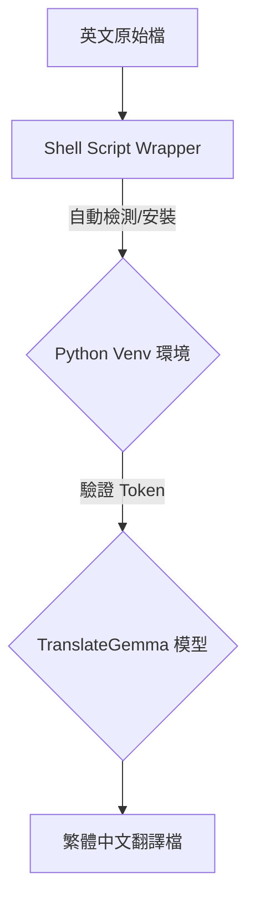

# TranslateGemma Translator

本工具利用 Google 開源的 `google/translategemma-4b-it` 模型，提供專業的英文至繁體中文（台灣風格）的翻譯服務。

## 功能特點

- **一鍵執行**：透過 Shell Script 自動建立隔離環境並安裝依賴，無須手動配置 Python 環境。
- **模型驅動**：採用 Google 的專用翻譯 LLM，翻譯品質優於傳統 NMT 模型。
- **繁體中文優化**：針對台灣用語習慣（如「資料」、「軟體」、「硬體」等）進行最佳化。
- **Markdown 支援**：完美保留 Markdown 格式，包括程式碼區塊、連結與結構。

## 快速參考

| 功能 | 指令 | 使用場景 |
|------|---------|----------|
| 單檔案翻譯 | `./translategemma-translator/scripts/translate.sh --input FILE --token HF_TOKEN` | 一般文件 |
| 批次翻譯 | `for f in docs/*.md; do ./translategemma-translator/scripts/translate.sh --input "$f" --token HF_TOKEN; done` | 大量文件 |

## 前置準備：Hugging Face Token

由於 `google/translategemma` 屬於受控模型，您必須：
1. 至 [Hugging Face 頁面](https://huggingface.co/google/translategemma-4b-it) 同意使用條款。
2. 取得 [Access Token](https://huggingface.co/settings/tokens)。
3. 在執行時透過 `--token` 參數提供，或設定環境變數 `export HF_TOKEN=your_token`。

## 工作流程



## 使用指南

### 1. 執行翻譯 (自動安裝環境)

您無需手動安裝 pip 套件，腳本會自動處理：

```bash
# 給予執行權限 (初次使用)
chmod +x translategemma-translator/scripts/translate.sh

# 翻譯特定檔案 (需提供 Token)
./translategemma-translator/scripts/translate.sh --input docs/manual.md --token hf_xxxxxxxxxxxx

# 或者先設定環境變數 (推薦)
export HF_TOKEN=hf_xxxxxxxxxxxx
./translategemma-translator/scripts/translate.sh --input docs/manual.md
```

## 配置與自定義

模型預設使用 `google/translategemma-4b-it`。您可以透過腳本參數調整：
- `--model_name`: 更換其他相容的 Hugging Face 模型路徑。
- `--device`: 指定 `cpu`、`cuda` 或 `mps` (MacOS Metal)。
- `--token`: 指定 Hugging Face Access Token。

## 版本紀錄

- **v1.1.0**: 新增 `translate.sh` 自動化腳本，自動處理 venv 與依賴安裝。
- **v1.0.0**: 初始版本，支援基本檔案翻譯與 TranslateGemma 模型整合。

## 品質檢查清單

- [ ] 翻譯結果是否為繁體中文？
- [ ] 專有名詞是否符合台灣用語（如：Data -> 資料）？
- [ ] Markdown 格式（如程式碼區塊）是否完整保留？
- [ ] 連結與圖片路徑是否正確？
